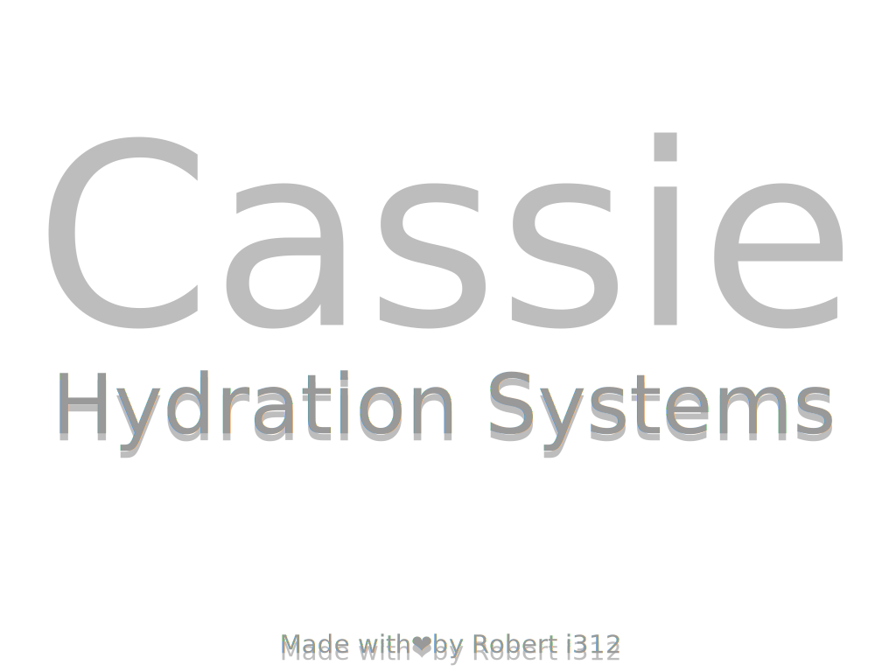
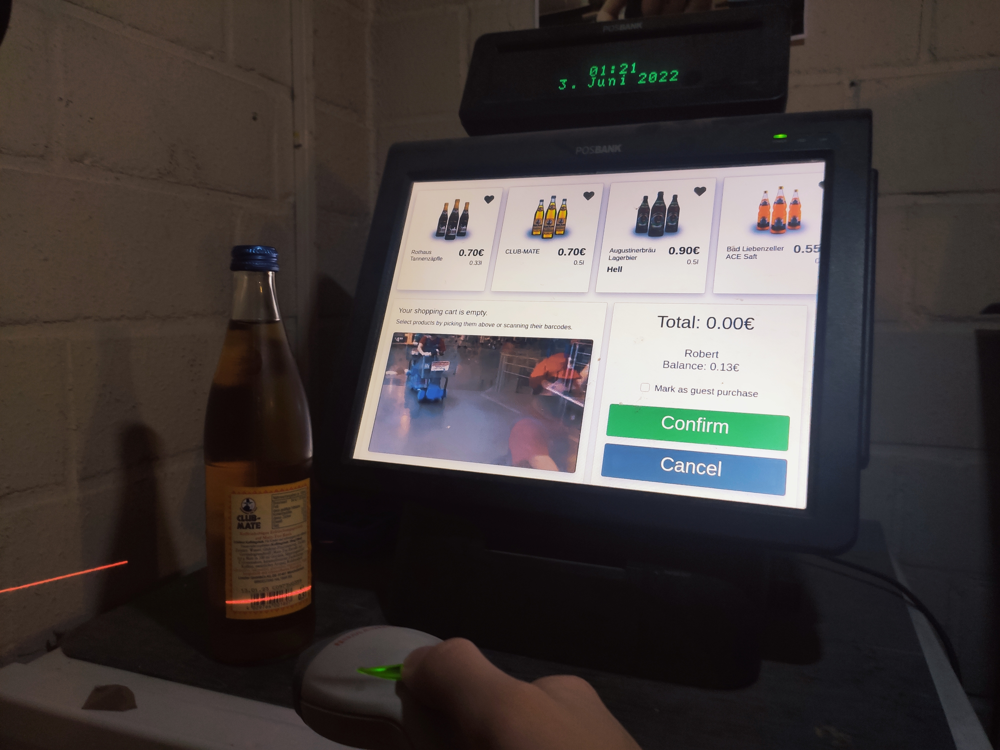
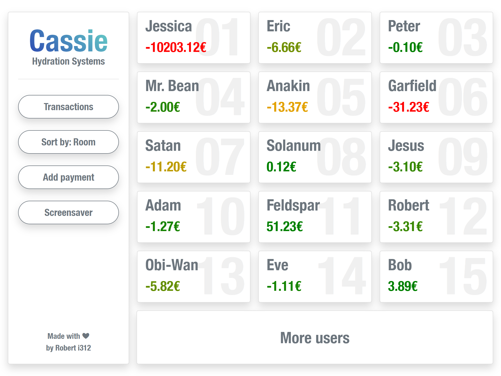
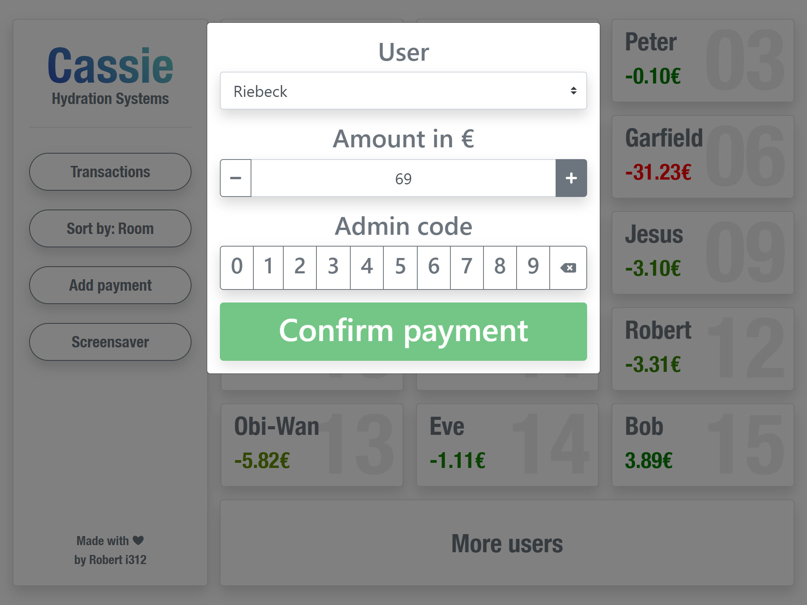
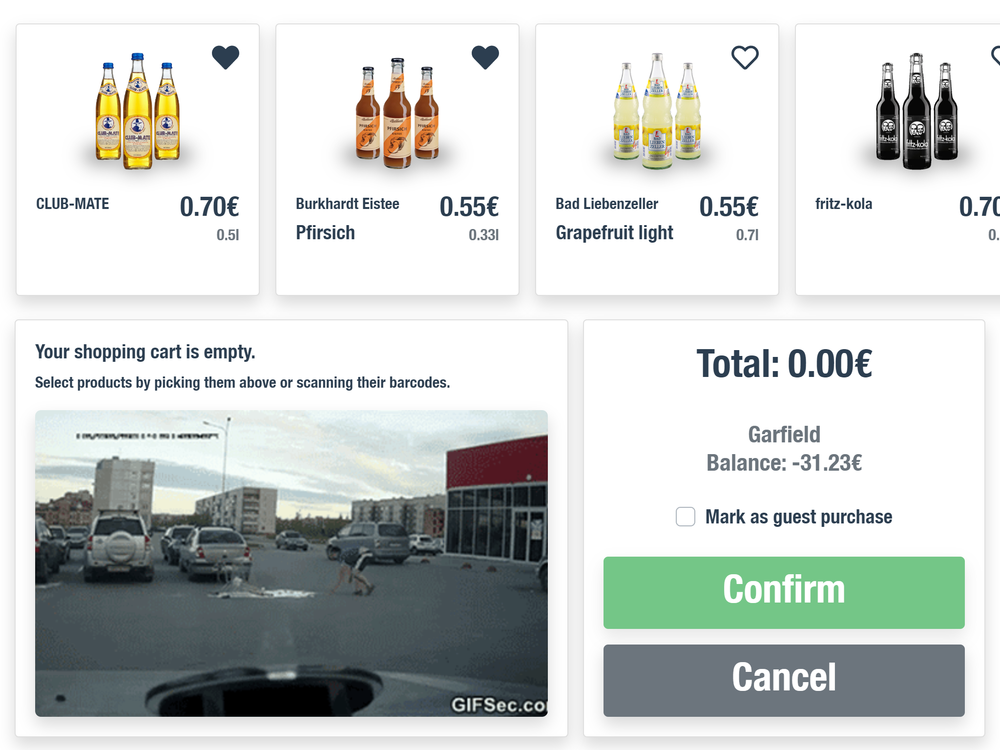
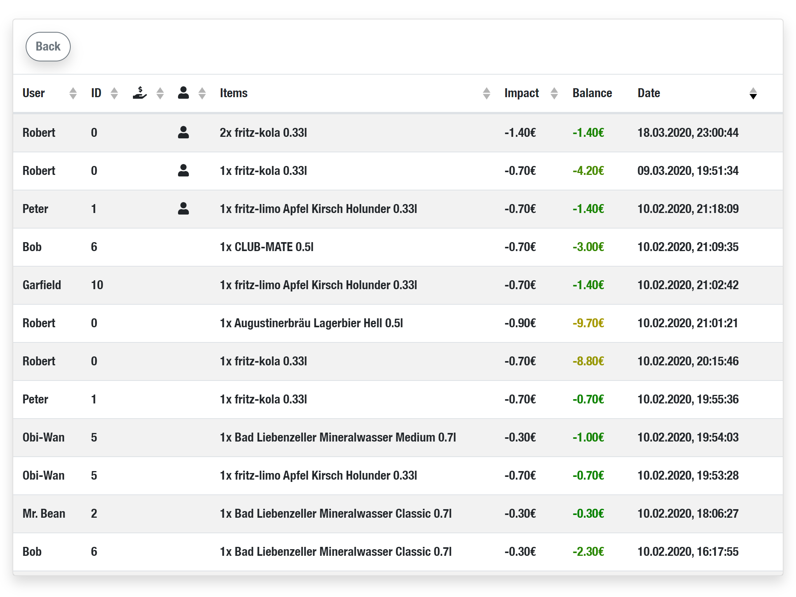

<p align="center">

</p>



Cassie Hydration Systems©℗®™ is a fancy unneccessarily over-engineered soft- & hardware replacement for a paper based split bill.
It runs on an old [POSBANK Imprex D5](https://www.newegg.com/posbank-imprex-d5-aio-15/p/N82E16849292010) and has been in daily use in my dorm since 2019.

Users have a balance and can purchase items by selecting them on screen or scanning them.
The system features a touch interface, liquid crystal customer display & usb barcode scanner. It stores all past transactions, allows for reimbusements, can handle variying users & items and works 100% offline.

It uses [Vue](https://vuejs.org/), [SocketIO](https://socket.io/), [Flask](https://flask.palletsprojects.com/) and stores data as [JSON](https://www.json.org/) files.

## Setup

### Requirements:

- [Python 3.7](https://www.python.org/) (possibly works on later versions as well)
- [Node.js](https://nodejs.org/en/)

#### Backend:
```
pip install -r requirements.txt
```

#### Frontend:
```
cd web

npm install
```

## Deploy
#### Backend:
```
python main.py noscan nocdp
```
(noscan & nocdp arguments disable scanner & customer display functionality)

#### Frontend:
```
cd web

npm run serve
```

# Screenshots

<p align="center">
   
</p>

NOTE: Receipt printers are incredibly fun to mess around with.

[](https://forthebadge.com) [](https://forthebadge.com) [](https://forthebadge.com)
